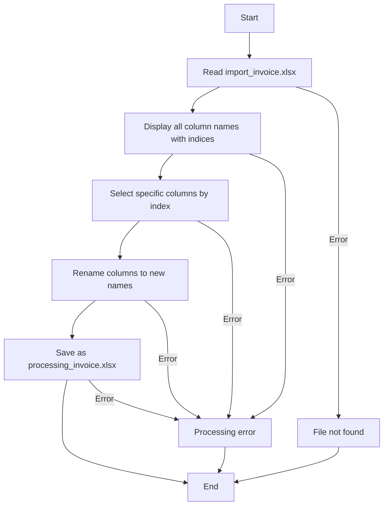

# Excel Data Processing Tool

This tool extracts specific columns from an `import_invoice.xlsx` file and creates a simplified `processing_invoice.xlsx` file with renamed columns.

## Overview

The Excel Data Processing Tool is designed to streamline the process of extracting and renaming specific columns from an invoice Excel file. It creates a more concise and focused checking list that contains only the essential information needed for verification purposes.

## Process Flow



## Requirements

- Python 3.6+
- pandas library
- openpyxl library

## Installation

1. Ensure Python 3.6+ is installed on your system
2. Install required libraries:

```bash
pip install pandas openpyxl
```

## Usage

1. Place your `import_invoice.xlsx` file in the same directory as the script
2. Run the script:

```bash
python excel_processor.py
```

3. The script will display all column names from the original file with their indices
4. If needed, update the `column_indices` dictionary in the script to match the correct indices
5. The script will generate a new file called `processing_invoice.xlsx` with the renamed columns

## Column Mapping

| New Column Name (processing_invoice.xlsx) | Column Index in import_invoice.xlsx | Original Purpose |
|--------------------------------------|-------------------------------------|------------------|
| Item#                                | 0                                   | Item Numbers     |
| P/N                                  | 2                                   | Part Number      |
| Model No.                            | 3                                   | Model Number     |
| Desc                                 | 4                                   | Description      |
| Qty                                  | 6                                   | Quantity in PCS  |
| Price                                | 7                                   | Unit Price in USD|

## Customization

If your Excel file has different column indices, you can modify the `column_indices` dictionary in the script after viewing the output of the column names and their indices.

## Error Handling

The script includes basic error handling for:
- Missing input file
- General exceptions during processing

## Example Output

The resulting `processing_invoice.xlsx` file will contain only the selected columns with their new names:

| Item# | P/N | Desc | Qty | Price |
|-------|-----|------|-----|-------|
| 1     | ABC123 | Widget A | 10  | 9.99  |
| 2     | DEF456 | Widget B | 5   | 19.99 |
| ...   | ...    | ...      | ... | ...   |

## Troubleshooting

If you encounter issues:

1. Ensure both Python and required libraries are properly installed
2. Verify that `import_invoice.xlsx` exists in the same directory as the script
3. Check the column indices displayed when running the script and update the mapping if necessary
4. Make sure you have write permissions in the directory to create the output file

## License

This tool is provided as-is under the MIT License.