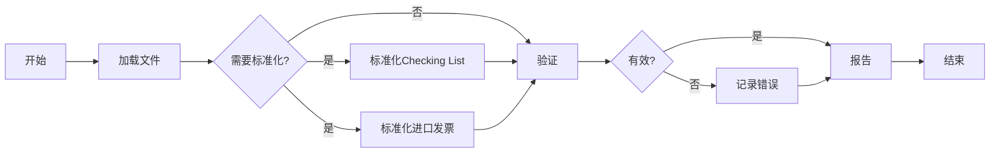
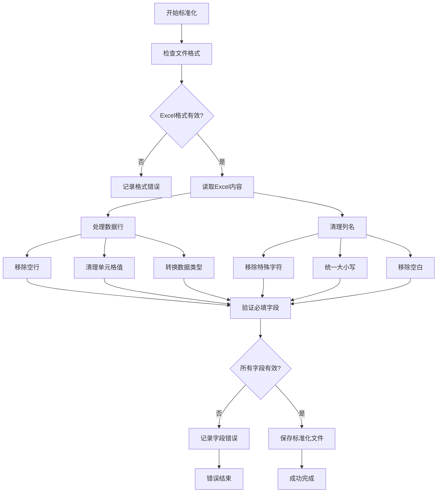
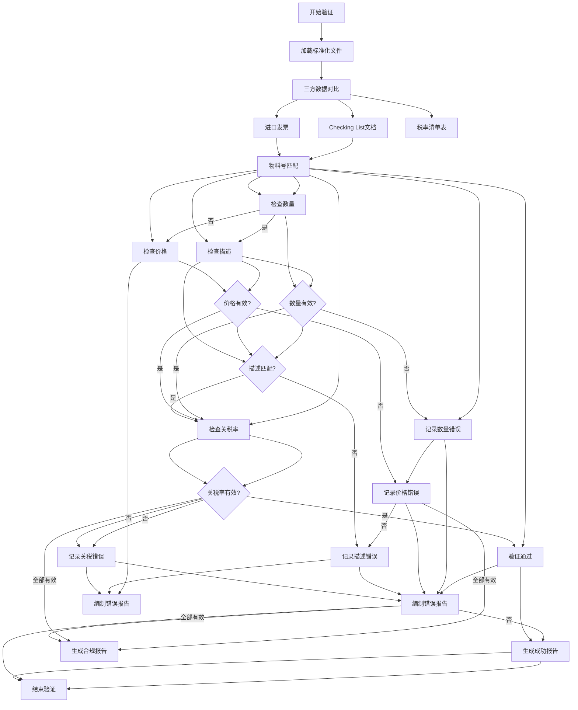

# 自定义清单验证系统

## 1. 流程概述 🌟

### 1.1 数据验证工作流的关键阶段

1. **🌱 开始** - 启动验证工作流
2. **📥 加载文件** - 导入三个关键文档：
   - Checklist文档（主数据文件）
   - 进口发票（运输清单）
   - 关税率汇总文件（海关税率表）

3. **🔄 标准化检查** - 确定是否需要数据标准化：
   - **🔧 标准化Checklist文档**（如需要）
   - **📦 标准化进口发票**（如需要）

4. **✅ 核心验证** - 交叉引用数据：
  - 三方数据对比：
    1. Checklist文档（主数据）包含字段：P/N, Desc, HSN, Duty, Welfare, IGST, Cus AIDC, Qty, Price, Category, Item#, TxtLine, Cus Notn, Value Amt
    2. 进口发票数据
    3. 关税率汇总数据
  - 验证步骤：
    a) **物料号匹配**：检查Checklist的P/N需与发票的P/N匹配（无P/N条目可忽略）
    b) **描述检查**：比对前需统一特殊字符格式
    c) **数量验证**：检查Checklist的Qty需与发票的Quantity PCS一致
    d) **价格容差**：允许±1.1%的单位价格差异
    e) **税率核查**：确保HSN编码匹配关税率汇总文件并验证：
       - Duty vs 最终BCD
       - Welfare vs 最终SWS
       - IGST vs 最终IGST
       - Cus AIDC vs 最终AIDC
    f) **新材料处理**：未识别物料添加至关税率汇总文件底部并标记为'新增条目'

5. **❓ 验证结果** - 评估结果：
   - **✔ 成功** → 生成合规报告
   - **❌ 发现错误** → 记录问题 → 生成错误报告

6. **🏁 完成** - 完成验证过程

### 1.2 基础流程摘要

### 1.3 详细流程说明

#### 1.3.1 标准化流程

#### 1.3.2 验证流程

> **注意：** 这个精简的流程确保了数据一致性和合规性，同时通过全面的报告维护清晰的审计跟踪。
