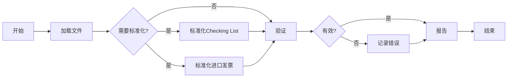
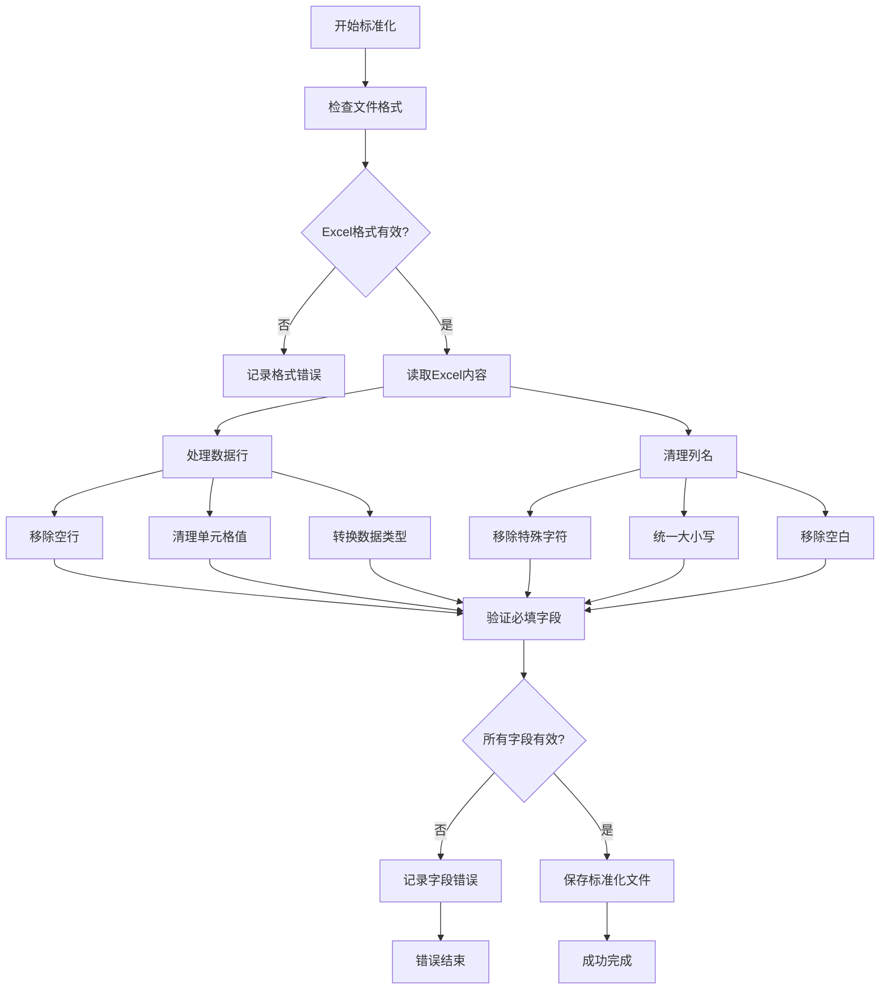
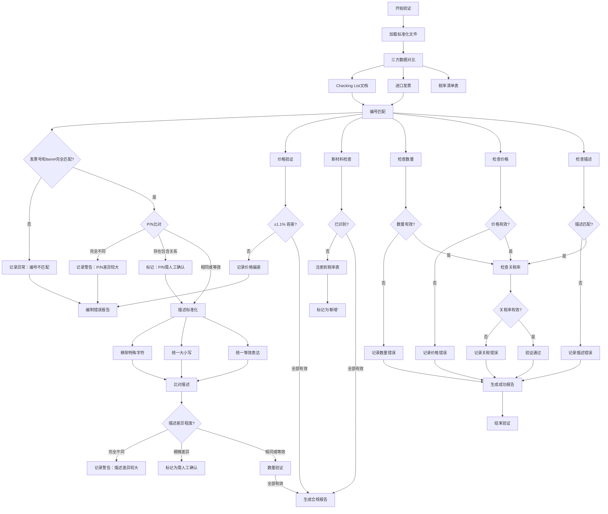

# 自定义清单验证系统

## 1. 流程概述 🌟

### 1.1 数据验证工作流的关键阶段

1. **🌱 开始** - 启动验证工作流
2. **📥 加载文件** - 导入三个关键文档：
   - Checklist文档（主数据文件）
   - 进口发票（运输清单）
   - 关税率汇总文件（海关税率表）

3. **🔄 标准化检查** - 确定是否需要数据标准化：
   - **🔧 标准化Checklist文档**（如需要）
   - **📦 标准化进口发票**（如需要）

4. **✅ 核心验证** - 交叉引用数据：
  - 三方数据对比：
    1. Checklist文档（主数据）包含字段：P/N, Desc, HSN, Duty, Welfare, IGST, Cus AIDC, Qty, Price, Item#, TxtLine, Cus Notn, Value Amt
    2. 进口发票数据
    3. 关税率汇总数据
  - 验证步骤：
    a) **编号匹配**：
       - **主要匹配**：发票号(Invoice No.)和Item#必须完全一致
       - **次要匹配**：P/N只需大致相同（允许存在小的差异，如大小写、特殊字符等）
       - **P/N截断处理**：
         * 对于存在包含关系的P/N（如 1.2.08.0 vs 1.2.08.09.10084）：
         * 系统会检测是否存在前缀匹配或包含关系
         * 标记为"P/N需人工确认"
         * 在最终报告中单独列出供人工判断
    b) **描述检查**：
       - 比对前需统一特殊字符格式
       - 允许描述存在等效表达（如温度符号"°"可以是"度"、"DEG"等）
       - 描述大致相同即可判定为同一物料
       - 对于细微差异的描述（如 CAPACITOR0.1UF1016VX5R(5585C)0402 vs CAPACITOR0.1UF1016VX5R(5585)0402）：
         * 系统会标记为"需人工确认"
         * 不阻断验证流程
         * 在最终报告中单独列出这些项目供人工复核
    c) **数量验证**：检查Checklist的Qty需与发票的Quantity PCS一致
    d) **价格容差**：允许±1.1%的单位价格差异
    e) **税率核查**：确保HSN编码匹配关税率汇总文件并验证：
       - HSN编码以纯数字形式表示，无需小数点（如：85045090 -> 85051110）
       - Duty vs 最终BCD
       - Welfare vs 最终SWS
       - IGST vs 最终IGST
    f) **新增Item Name处理**：
       - 未识别物料添加至关税率汇总文件底部并标记为'新增条目'
       - 税率显示格式：原税率 -> 新税率项目（如：15.0 -> 新税率项目）
       - HSN编码使用纯数字格式，不带小数点
       - 此标记便于后续人工确认和更新正确税率

5. **❓ 验证结果** - 评估结果：
   - **✔ 成功** → 生成合规报告
   - **❌ 发现错误** → 记录问题 → 生成错误报告

6. **🏁 完成** - 完成验证过程

### 1.2 基础流程摘要

### 1.3 详细流程说明

#### 1.3.1 标准化流程

#### 1.3.2 验证流程

> **注意：** 这个精简的流程确保了数据一致性和合规性，同时通过全面的报告维护清晰的审计跟踪。
